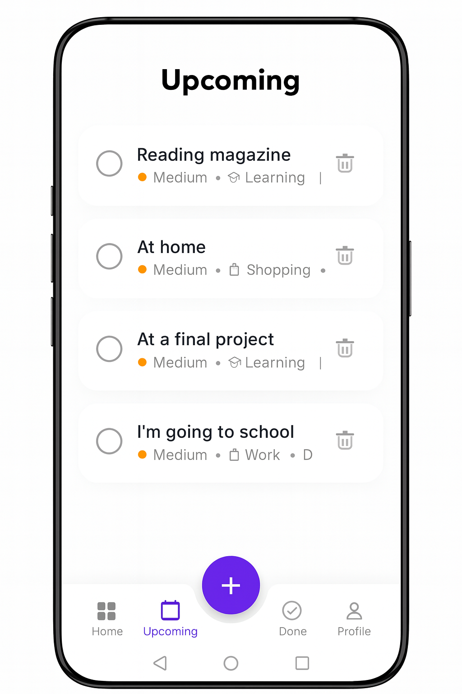
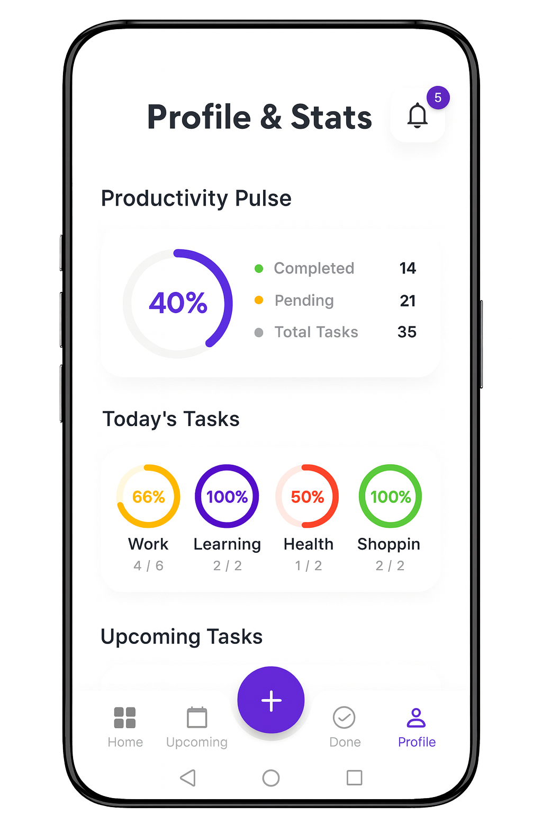
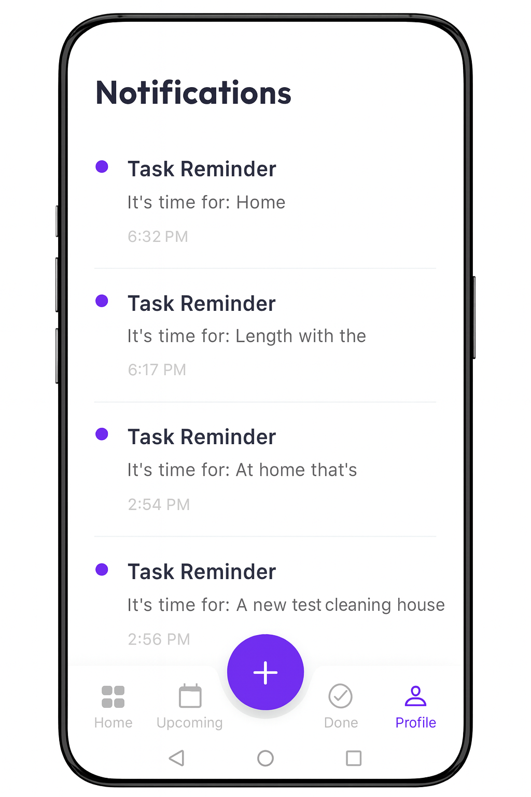

# VOCALIST
### Speak, Organize, Accomplish - Your AI Voice Task Manager

<p align="center">
  
  
  
</p>

<p align="center">
  Built with the tools and technologies:
</p>

<p align="center">
  
  
  
</p>

<br>

## Table of Contents
- [Overview](#overview)
- [Why Vocalist?](#why-vocalist)
- [Architecture](#architecture)
- [Getting Started](#getting-started)
  - [Prerequisites](#prerequisites)
  - [Installation](#installation)
- [Usage](#usage)
  - [Adding Tasks by Voice](#adding-tasks-by-voice)
  - [Managing Categories](#managing-categories)
  - [Navigation & Filtering](#navigation--filtering)
- [Project Structure](#project-structure)
- [Screenshots](#screenshots)
- [Contributing](#contributing)
- [License](#license)

<br>

## Overview
**Vocalist** is a modern, powerful Flutter application that transforms your voice into organized action. Capture tasks, meetings, and ideas hands-free using advanced speech recognition. The app automatically extracts dates, times, and categories from natural language, storing everything locally on your device for instant offline access.

<br>

## Why Vocalist?
In a fast-paced world, typing out to-do lists slows you down. Vocalist provides:

- **Speed**: Add complex tasks with due dates in seconds without typing a single word.
- **Intelligence**: Natural language processing understands "tomorrow at 5pm" or "after 3 days".
- **Convenience**: Hands-free management of your entire day.
- **Privacy**: No cloud dependencies - your data stays 100% on your device using Hive.
- **Professional Output**: A premium, clean UI designed for focus and clarity.

<br>

## Key Features
- 🎙️ **Smart Voice Entry**: Speak naturally—Vocalist handles the parsing.
- 📅 **Intelligent Dates**: "Call Mom in 20 minutes" automatically sets a reminder.
- 📂 **Dynamic Categories**: Create and organize custom lists like Work, Personal, or Gym.
- 🔔 **Real-Time Reminders**: Accurate notifications ensure you never miss a deadline.
- 🌓 **Dark Mode**: Full support for light and dark themes.
- ⚡ **Smooth Animations**: Engaging transitions powered by Flutter Animate.

<br>

## Architecture
The app follows a functional feature-first Clean Architecture pattern with clear separation of concerns:

```
lib/
├── main.dart                 # App entry point
├── core/                     # Core utilities & services
│   ├── services/             # Voice, Hive, Notifications
│   ├── theme/                # App Theme definition
│   └── utils/                # Date & Category helpers
├── features/                 # Feature-based functionality
│   ├── todo/
│   │   ├── data/             # Models (Task) & Repositories
│   │   └── presentation/     # Screens (Home, Lists) & Providers
│   └── notifications/        # Notification logic
└── generated/                # Code-generated files
```

### Tech Stack
- **Framework**: Flutter 3.0+
- **Language**: Dart
- **State Management**: Riverpod (v2 with code gen)
- **Local Database**: Hive (NoSQL)
- **Voice Engine**: speech_to_text
- **Animations**: flutter_animate
- **Typography**: google_fonts

<br>

## Getting Started

### Prerequisites
Before you begin, ensure you have:
- Flutter SDK (version 3.0.0 or higher)
- Dart SDK (version 2.17.0 or higher)
- Android Studio / VS Code with Flutter extensions
- A physical device for testing Voice (Simulators may not support mic input)

### Installation

1. **Clone the repository**
   ```bash
   git clone https://github.com/OsmanMj/Vocalist.git
   cd vocalist
   ```

2. **Install dependencies**
   ```bash
   flutter pub get
   ```

3. **Run Code Generation**
   ```bash
   flutter pub run build_runner build --delete-conflicting-outputs
   ```

4. **Run the app**
   ```bash
   flutter run
   ```

<br>

## Usage

### Adding Tasks by Voice
Tap the microphone and speak naturally.
- **Simple**: "Add Buy Milk"
- **With Date**: "Meeting with John at 5pm"
- **Relative Time**: "Remind me to exercise in 30 minutes"
- **Context Aware**: "Add task" (while in 'Work' category adds to Work)

<p align="center" style="color: grey; font-size: 0.9em;">
  <em>Note: The microphone and voice recognition features require an active Wi-Fi or internet connection to function correctly.</em>
</p>

### Managing Categories
You can manage your lists entirely by voice.
- **Create**: "Create category Gym"
- **Delete**: "Delete category Personal"
- **Rename**: "Rename category Work to Office"

### Navigation & Filtering
- **Show All**: "Show me my tasks"
- **Time-Based**: "Show Today", "Show Tomorrow", "Show Upcoming"
- **Status**: "Show Completed"

<br>

## Project Structure
### Key Components

#### Providers
- **TodoList**: Manages CRUD operations for tasks.
- **NotificationNotifier**: Handles local notification scheduling.
- **CategoryList**: Manages dynamic user categories.

#### Screens
- **HomeScreen**: Dashboard with category overview.
- **CategoryTasksScreen**: Detailed list view for specific filters.
- **VoiceListeningDialog**: The core UI for voice interaction.

<br>

## Screenshots

| Home Screen | Upcoming Tasks | Complete Tasks | Profile | Notifications |
| :---: | :---: | :---: | :---: | :---: |
|  |  |  |  |  |

<br>

## Contributing
Contributions are welcome! Here's how you can help:

1. Fork the repository
2. Create a feature branch (`git checkout -b feature/AmazingFeature`)
3. Commit your changes (`git commit -m 'Add some AmazingFeature'`)
4. Push to the branch (`git push origin feature/AmazingFeature`)
5. Open a Pull Request

<br>

## License
This project is licensed under the MIT License - see the LICENSE file for details.

---
<p align="center">Made with ❤️ using Flutter</p>

